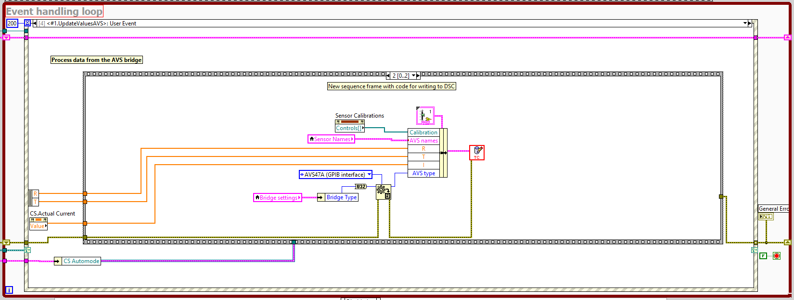
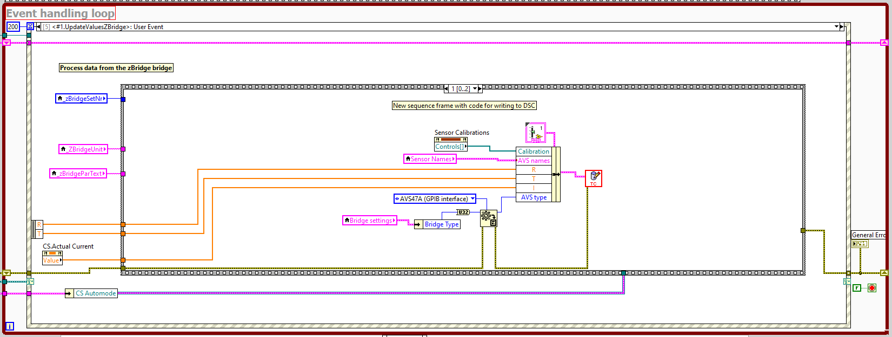

# How to contribute

Thanks for taking the time to contribute!

## How can I contrubute?

1. Submit bug reports or suggestions [here](https://github.com/levylabpitt/Leiden-FP/issues).
2. I want to submit code [What do I need to know?](#What-do-I-need-to-know)

## What do I need to know?

### Project structure

```
Leiden-TC
|
+---README.md
|
+---LICENSE
|
+---TC.lvproj           #LabVIEW project containing with Application and Installer Build Specifications
|
+---\src\
|   |
│   +---\1. Sources\            #Replace this folder when Leiden Cryogenics updates their source code
|   |   |
|   |   +---TC.vi
|   |   
│   +---\Write to DSC\          #This folder contains utilities for writing data to DSC database
|       |
│       +---\TC to DSC\     
|           |
|           +---TC_to_DSC.vi\   #This is file you will insert into TC.vi
| 
+---\backups\                   #Put backups of TC.vi here
|   |
|   +---TC-X-backup.vi  #Backup of version "X"
|
+---\build support\             
|   |
|   +---TC Post Build.vi        #Run to turn create a one file installer
|
+---\builds\Latest              #Find the latest single file installer files here

```

### Building a new version

0. *Make sure you are using LabVIEW 2013*
1. Get new source files from Leiden Cryogenics
2. Unzip source file and find the "1. Sources" folder
3. *Replace* the "1. Sources" folder in "\Project\src\"


4. Open a backup copy of TC-X-backup.vi to see how to modify the new FrontPanel.vi (See screenshots below)






5. Save all

6. Increment version number and build the Application under "Build Specifications" in the Project Explorer


7. Increment version number and build the Installer under "Build Specifications" in the Project Explorer


8. Run "FP Post Build.vi" with version numbers matching the builds above


